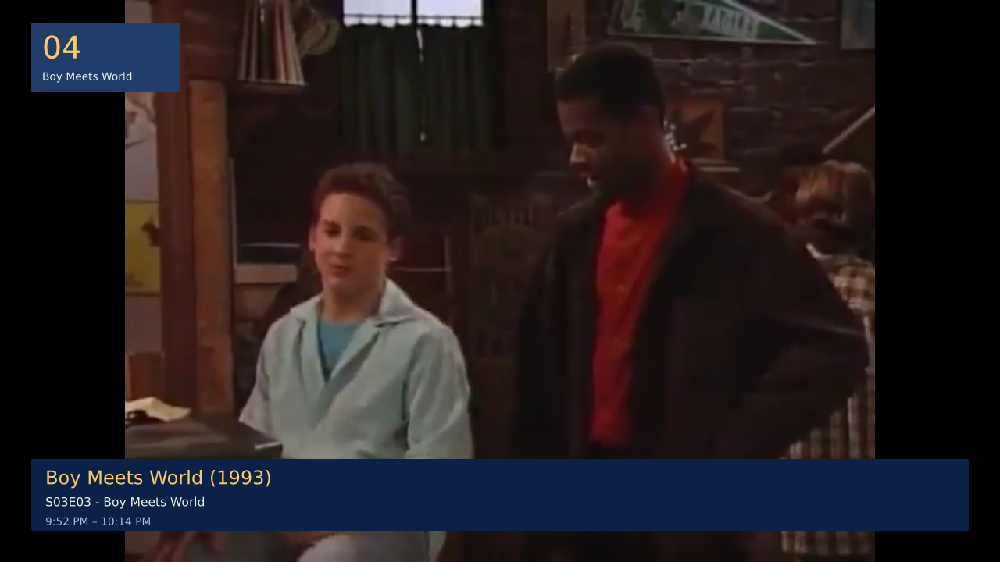
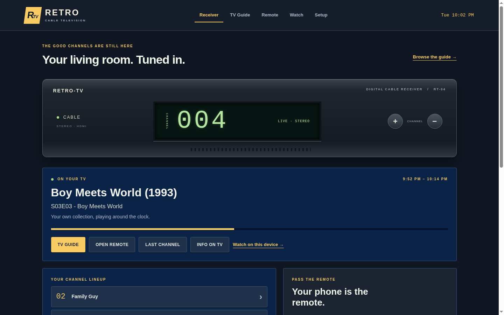
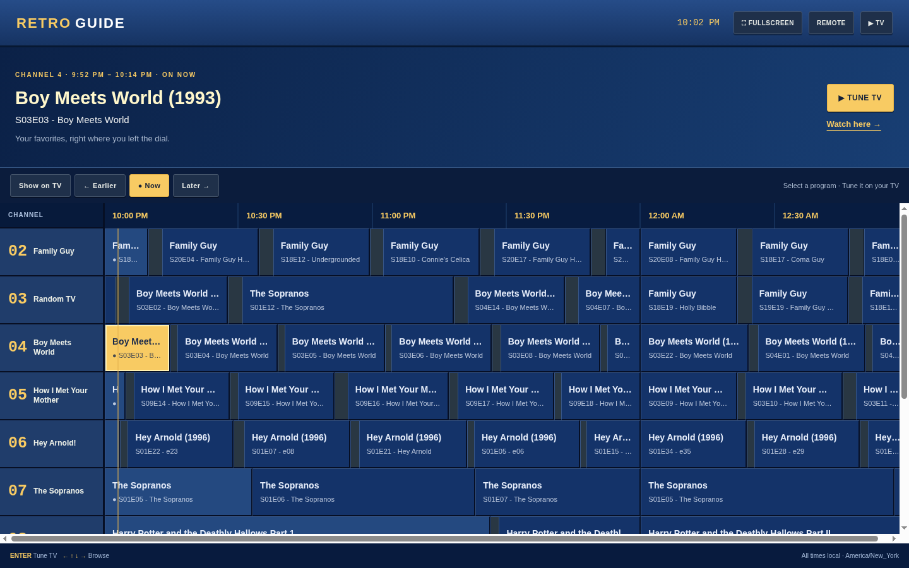
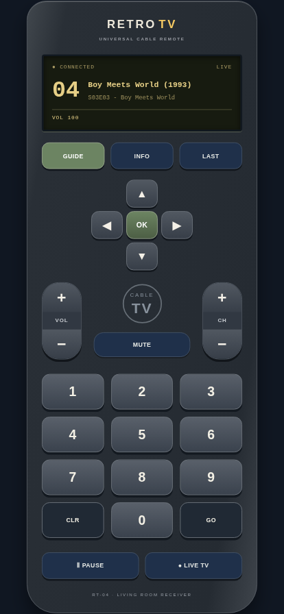
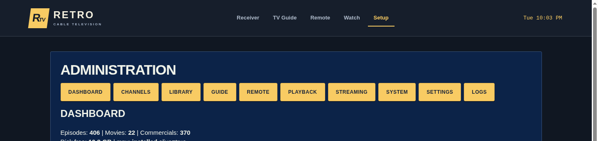

# Retro TV

Turn a personal media library into a live cable-TV experience. Retro TV builds
continuous, multi-day channel schedules from your own video files, plays them
on an HDMI-connected TV like a real cable box, and lets you change channels
and browse a program guide from your phone — no per-user pause/rewind, just
tune in to whatever's "on" right now.

Runs on a Raspberry Pi 4 (or similar Linux box) with a TV on HDMI and your
media on the local network.

## Screenshots

<p align="center"></p>
<p align="center"><em>The real HDMI output — punching in a channel shows a classic cable-box banner, then fades away.</em></p>

<table>
<tr>
<td width="50%"><br><em>Home — current channel, live program, and your lineup</em></td>
<td width="50%"><br><em>TV Guide — a real multi-channel program grid</em></td>
</tr>
<tr>
<td width="50%"><br><em>Phone remote — channel keypad, guide, volume</em></td>
<td width="50%"><br><em>Setup — library stats and channel management</em></td>
</tr>
</table>

## Features

- **Always-live playback** — every program has a fixed start/end time. Change
  channels or reload a page and you rejoin the current scene, exactly like
  broadcast TV.
- **Auto-generated schedules** — episodes, movies, and commercial breaks are
  interleaved per channel and generated days in advance, without ever
  rewriting programs that have already aired.
- **Fair commercial rotation** — long commercial compilations are sliced into
  segments and rotated fairly across breaks instead of repeating from the
  start every time.
- **On-TV program guide** — a classic channel guide overlay, driven entirely
  over the HDMI output (no second video layer needed).
- **Phone remote** — control the TV, browse the guide, and jump channels from
  any browser on your network.
- **Watch anywhere** — stream the live channel to a browser (`/watch`) in
  addition to the HDMI output, with on-the-fly remuxing/transcoding for
  browser-incompatible formats.
- **Automatic metadata** — episode titles, descriptions, and artwork are
  backfilled from TVMaze in the background; everything still works offline
  from filenames alone.

## Requirements

- Raspberry Pi 4 (4 GB+) or another Linux machine with an HDMI output, or any
  Linux host if you only need browser streaming
- Python 3.9+
- [mpv](https://mpv.io/), `ffmpeg`/`ffprobe`
- Your media organized under a root directory as:
  ```
  media/
    TVShows/<Show>/Season 0X/... 
    Movies/...
    Commercials/...
  ```

## Quick start

```bash
git clone https://github.com/chartmann1590/retro-tv.git
cd retro-tv
python3 -m venv venv
venv/bin/pip install -r requirements.txt
venv/bin/python app.py
```

The app starts on port `5000`, scans your media, builds the first few days of
schedules, and restores playback automatically. Point `MEDIA_ROOT` in
`config.py` at your media directory if it isn't `/srv/media`.

For a full Raspberry Pi installation (system packages, a `systemd --user`
service, and kiosk autostart), use the installer instead:

```bash
bash scripts/install.sh
```

Read the script before running it — it installs system packages and can run
as root.

## Using it

- **Remote:** open `http://<pi-address>:5000/remote` on a phone on the same
  network. The receiver's homepage shows its current network address.
- **Guide:** press **GUIDE** on the remote to show the channel guide on the
  TV and phone. Pick a program, then press **TUNE TV**.
- **Watch:** `/watch` streams the live channel to whatever device opened the
  page.
- **Admin:** `/admin` manages channels, triggers media scans, and inspects
  schedules.

## Configuration

All paths, the timezone, and the port live in `config.py`. Notable settings:

| Setting | Purpose |
|---|---|
| `MEDIA_ROOT` | Root directory containing `TVShows/`, `Movies/`, `Commercials/` |
| `TIMEZONE` | Timezone used for schedule days (default `America/New_York`) |
| `SCHEDULE_DAYS_AHEAD` | How many days of schedule to keep generated per channel |
| `RETRO_TV_AUDIO_DEVICE` (env var) | Overrides automatic HDMI audio device discovery |

## Service management (installed via `install.sh`)

```bash
systemctl --user status retro-tv.service
systemctl --user restart retro-tv.service
journalctl --user -u retro-tv.service -n 50
```

## Development

```bash
venv/bin/python -m unittest discover -s tests -v          # run tests
venv/bin/python -m py_compile *.py scripts/*.py tests/*.py # syntax check
bash -n scripts/install.sh scripts/kiosk.sh                # shell syntax check
```

Tests isolate SQLite in a temp directory and mock HDMI/mpv calls — they never
touch real media or the production database.

Module responsibilities, in the order data flows: `scanner.py` walks your
media and parses show/episode info from filenames; `metadata.py` backfills
descriptions/genre/artwork from TVMaze and OMDb; `scheduler.py` builds the
per-channel lineups and commercial rotation; `streaming.py`/`playback.py`
serve the browser and HDMI outputs respectively; `tvguide.py` draws the
on-TV guide and channel-change banner as an mpv overlay; `app.py` ties it
together with the Flask routes and the background maintenance loop.

## Notes on hardware

mpv uses hardware decoding and a persistent player process (reused across
channel changes) tuned for a Raspberry Pi 4 driving 1080p HDMI. Browser
streaming only copies video and transcodes audio when needed — it never
transcodes video — so some source formats will play on HDMI but not in a
browser tab. Keep the Pi adequately cooled for sustained playback.

## Important: exactly one instance

Run only one instance of Retro TV per media directory. The scheduler, HDMI
player, and TV guide overlay all share in-process state (current playback
position, the mpv IPC socket, and the schedule lock) — a second instance
against the same data will corrupt playback state.

## License

MIT — see [LICENSE](LICENSE).
