# Retro TV

[](https://buymeacoffee.com/charleshartmann)
[](https://chartmann1590.github.io/retro-tv/)
[](LICENSE)

Turn a personal media library into a live cable-TV experience. Retro TV builds
continuous, multi-day channel schedules from your own video files, plays them
on an HDMI-connected TV like a real cable box, and lets you change channels
and browse a program guide from your phone — no per-user pause/rewind, just
tune in to whatever's "on" right now.

Runs on a Raspberry Pi 4 (or similar Linux box) with a TV on HDMI and your
media on the local network.

🌐 **Explore the interactive showcase website:** [https://chartmann1590.github.io/retro-tv/](https://chartmann1590.github.io/retro-tv/)  
☕ **Support this project:** [buymeacoffee.com/charleshartmann](https://buymeacoffee.com/charleshartmann)

## Screenshots

<p align="center">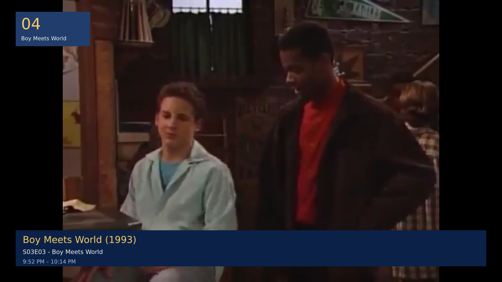</p>
<p align="center"><em>The real HDMI output — punching in a channel shows a classic cable-box banner, then fades away.</em></p>

<table>
<tr>
<td width="50%">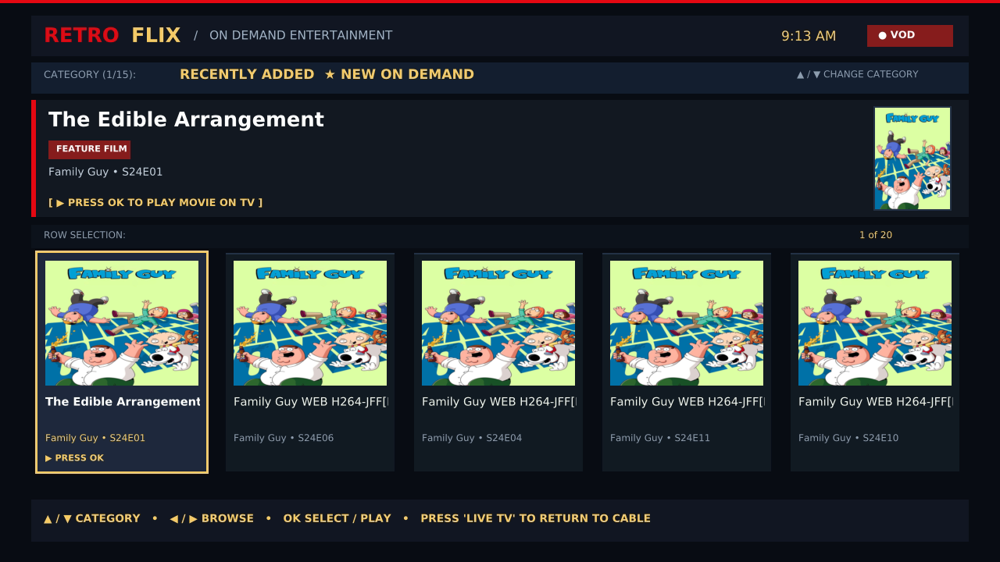<br><em><b>On-TV VOD Menu</b> — native high-performance mpv ASS overlay for browsing movies &amp; shows with remote D-pad directly on HDMI TV</em></td>
<td width="50%">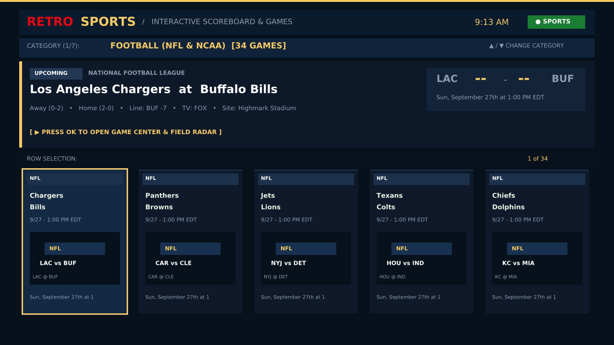<br><em><b>On-TV Sports Center</b> — native TV overlay displaying live scoreboards, league categories, and game matchups</em></td>
</tr>
<tr>
<td colspan="2" width="100%">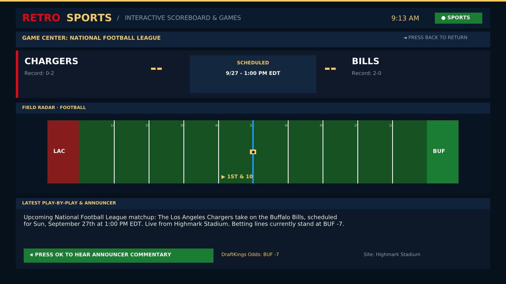<br><em><b>On-TV Game Center &amp; Field Radar</b> — vector football gridiron radar, line of scrimmage marker, box score, and one-click neural TTS play-by-play announcer on TV</em></td>
</tr>
<tr>
<td width="50%">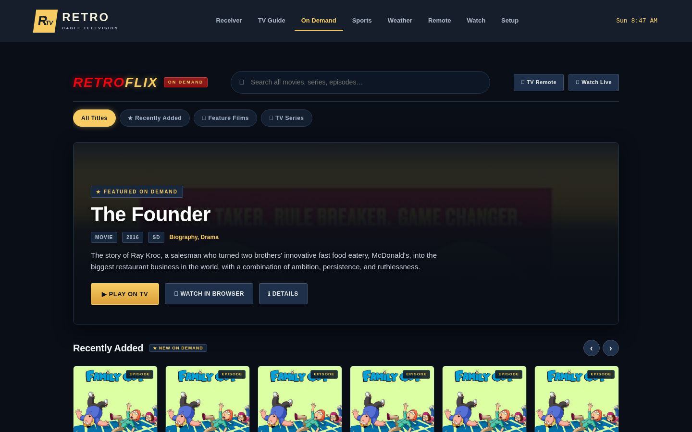<br><em><b>On Demand (VOD)</b> — spotlight hero billboard, category carousels, instant search, and one-click play on TV (`/vod`)</em></td>
<td width="50%">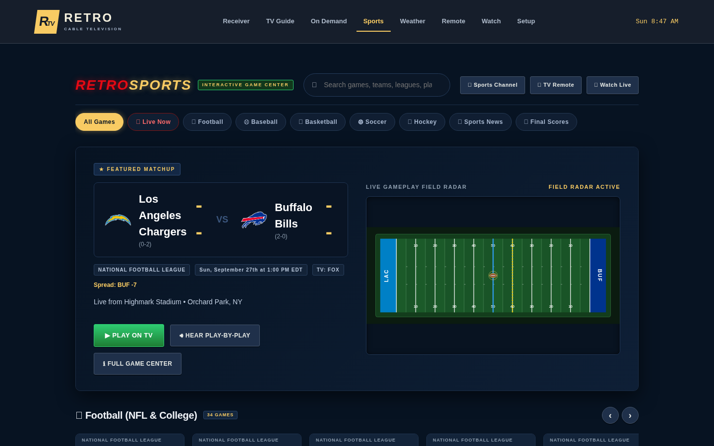<br><em><b>Sports Center</b> — live scores, vector SVG gameplay field radars (football, baseball, basketball, hockey, soccer) (`/sports`)</em></td>
</tr>
<tr>
<td width="50%">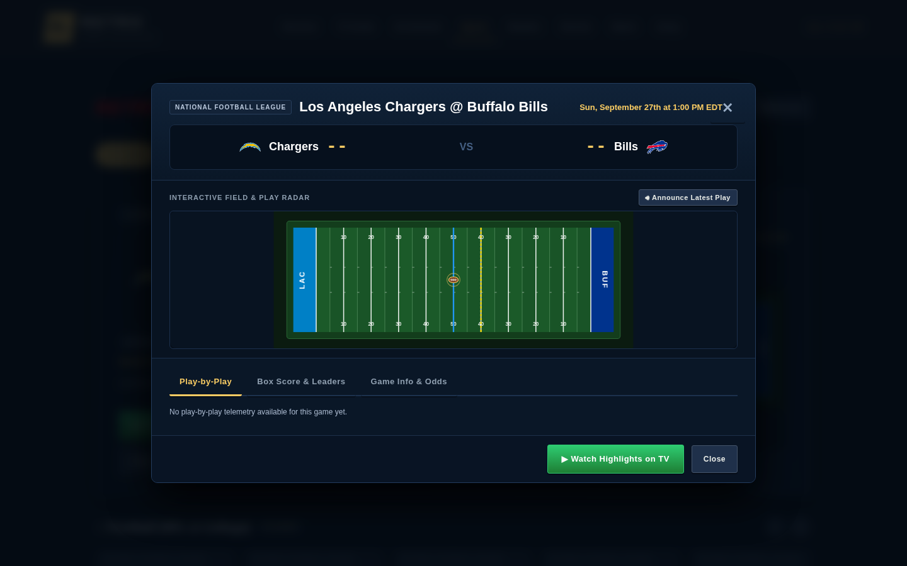<br><em><b>Game Center Modal</b> — interactive field radar, box score, team stats, and neural TTS announcer play-by-play</em></td>
<td width="50%">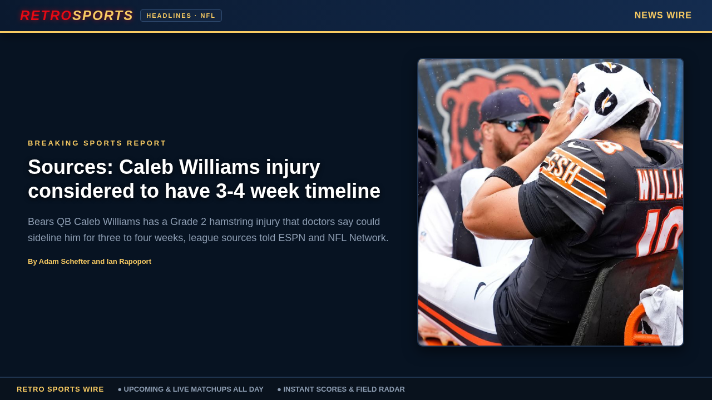<br><em><b>Sports Channel (Ch 38)</b> — 1280x720 broadcast loop with news wire, live game scores, and natural voice narration</em></td>
</tr>
<tr>
<td width="50%">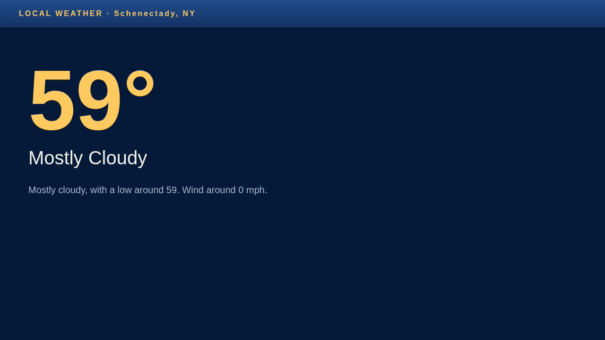<br><em><b>Local Weather Scan</b> — observations, NWS narrative, hourly trajectory, 7-day outlook, and live Doppler radar map (`/weather`)</em></td>
<td width="50%">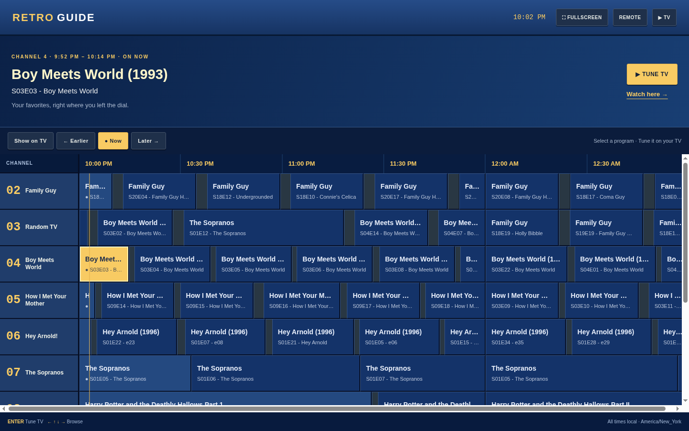<br><em><b>TV Guide</b> — real multi-channel program grid with synchronous time scale (`/guide`)</em></td>
</tr>
<tr>
<td width="50%">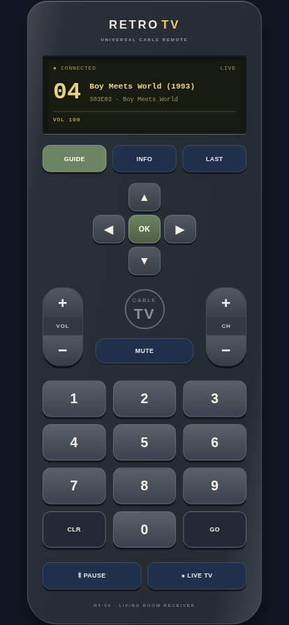<br><em><b>Phone Remote</b> — tactile handset with amber LCD screen, green SPORTS button, ON DEMAND, and D-pad (`/remote`)</em></td>
<td width="50%">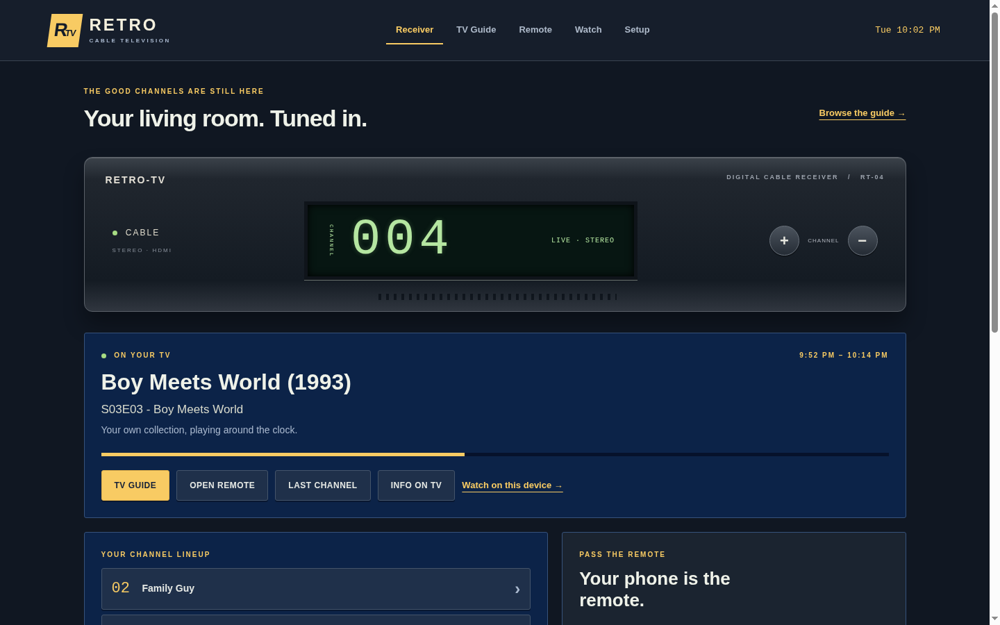<br><em><b>Receiver Home</b> — brushed hardware housing, green LED display, current program, and channel lineup</em></td>
</tr>
<tr>
<td width="50%">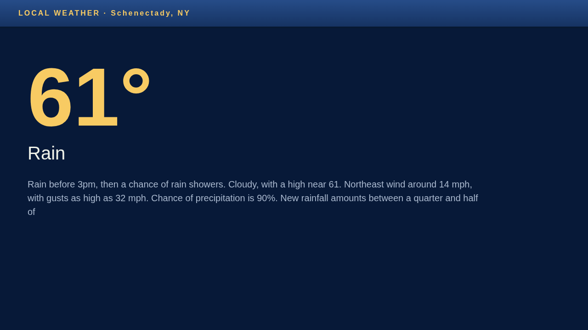<br><em><b>Local Weather TV Channel</b> — live NWS forecast video card, narrated, generated on-device every 30 minutes</em></td>
<td width="50%">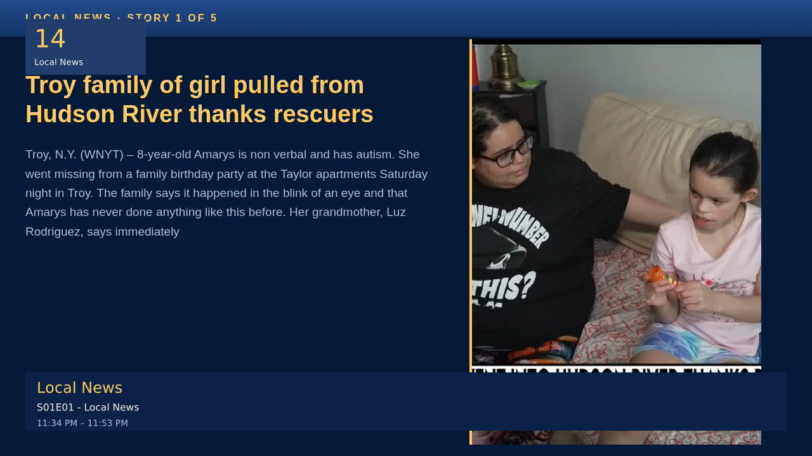<br><em><b>Local News TV Channel</b> — live local headlines with photos and natural voice narration, generated on-device</em></td>
</tr>
<tr>
<td colspan="2" width="100%">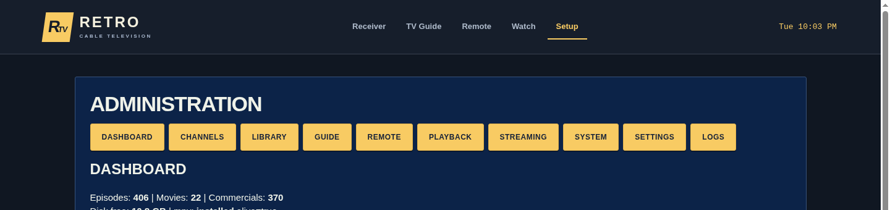<br><em><b>Setup & Admin</b> — library stats, channel management, transcode disk headroom, and schedule inspection (`/admin`)</em></td>
</tr>
</table>

## Features

- **Always-live playback** — every program has a fixed start/end time. Change
  channels or reload a page and you rejoin the current scene, exactly like
  broadcast TV.
- **Auto-generated schedules** — episodes, movies, and commercial breaks are
  interleaved per channel and generated days in advance, without ever
  rewriting programs that have already aired.
- **Fair commercial rotation** — long commercial compilations are sliced into
  segments and rotated fairly across breaks instead of repeating from the
  start every time.
- **Movie genre channels** — genres with at least five available movies get
  dedicated channels automatically. Each day has a shuffled lineup with
  90–180-second commercial breaks between movies. The hourly scheduler keeps
  three days ready; newly indexed movies enter new schedules as they are built.
  Existing genre channels, including disabled ones, retain their settings.
- **On-TV program guide** — a classic channel guide overlay, driven entirely
  over the HDMI output (no second video layer needed).
- **Phone remote** — control the TV, browse the guide, and jump channels from
  any browser on your network.
- **Watch anywhere** — stream the live channel to a browser (`/watch`) in
  addition to the HDMI output, with on-the-fly remuxing/transcoding for
  browser-incompatible formats.
- **Automatic metadata** — episode titles, descriptions, and artwork are
  backfilled from TVMaze in the background; everything still works offline
  from filenames alone.
- **Live Weather and News channels** — real local forecast (NWS) and local
  news headlines, narrated by a natural neural voice and generated entirely
  on-device as actual video files every 30 minutes: one continuous ~30-minute
  block per cycle, then a commercial break, just like a real local channel.
- **Auto-created channels** — any show with enough episodes and no channel of
  its own yet gets one automatically as your library grows.

## Requirements

- Raspberry Pi 4 (4 GB+) or another Linux machine with an HDMI output, or any
  Linux host if you only need browser streaming
- Python 3.9+
- [mpv](https://mpv.io/), `ffmpeg`/`ffprobe`
- `chromium` (headless) — only needed for the Weather/News channels; it's how
  their cards are rendered
- Internet access for TVMaze/OMDb metadata and the Weather/News channels
  (Microsoft Edge TTS, NWS, and your chosen local news RSS feed all require
  connectivity — everything else works fully offline)
- Your media organized under a root directory as:
  ```
  media/
    TVShows/<Show>/Season 0X/... 
    Movies/...
    Commercials/...
  ```

## Quick start

```bash
git clone https://github.com/chartmann1590/retro-tv.git
cd retro-tv
python3 -m venv venv
venv/bin/pip install -r requirements.txt
venv/bin/python app.py
```

The app starts on port `5000`, scans your media, builds the first few days of
schedules, and restores playback automatically. Point `MEDIA_ROOT` in
`config.py` at your media directory if it isn't `/srv/media`.

For a full Raspberry Pi installation (system packages, a `systemd --user`
service, and kiosk autostart), use the installer instead:

```bash
bash scripts/install.sh
```

Read the script before running it — it installs system packages and can run
as root.

## Using it

- **Remote:** open `http://<pi-address>:5000/remote` on a phone on the same
  network. The receiver's homepage shows its current network address.
- **Guide:** press **GUIDE** on the remote to show the channel guide on the
  TV and phone. Pick a program, then press **TUNE TV**.
- **On Demand (VOD):** `/vod` opens the Retroflix on-demand catalog with spotlight
  hero banner, genre filter chips, and instant play on TV or in-browser. Press
  **ON DEMAND** on the phone or USB remote to launch the on-TV VOD browser.
- **Sports:** `/sports` provides a dedicated interactive sports screen featuring
  live/upcoming games, scores, SVG gameplay field radar (football gridiron with
  down & distance, baseball diamond with runners, basketball court, hockey rink,
  soccer pitch), play-by-play with Kokoro TTS audio commentary, box scores,
  and news. Press **SPORTS** on the remote to launch the interactive on-TV
  Sports Center overlay.
- **Sports Channel:** Channel 38 ("Retro Sports") broadcasts a continuous loop
  of sports news, live game scores, matchups, and standings narrated by natural
  Kokoro TTS voices.
- **Weather:** `/weather` provides an interactive local weather scan with live
  observations, NWS forecast narrative, hourly trajectory, 7-day outlook,
  live Doppler radar sweeps, and audio narration playback.
- **Watch:** `/watch` streams the live channel to whatever device opened the
  page.
- **Admin:** `/admin` manages channels, triggers media scans, and inspects
  schedules.

### Setting up the Sports Backend (ArenaPulse)

The sports channel and interactive sports screen connect to the
[ArenaPulse Sports Dashboard](https://github.com/chartmann1590/sports-dashboard).
Run it with Docker on the same machine or anywhere on your local network:

```bash
git clone https://github.com/chartmann1590/sports-dashboard.git
cd sports-dashboard
docker compose --profile tts up -d
```
*(Running with `--profile tts` enables the local Kokoro neural TTS announcer sidecar).*

To configure Retro-TV, copy `.env.example` to `.env` and set `ARENAPULSE_URL`:

```bash
cp .env.example .env
```

```bash
# In .env:
ARENAPULSE_URL=http://<sports-server-address>:3000
```
If `.env` is omitted, Retro-TV defaults to `http://localhost:3000`.

### XING WEI USB remote

The XING WEI 2.4G receiver (USB `1915:1025`) works alongside the phone remote,
even when mpv has focus. Install `requirements.txt` and give the service user
read access to its input devices (the `input` group on this Pi). The service
automatically reconnects the keyboard and consumer-control interfaces after
unplugging/reconnecting the receiver. Only those two receiver interfaces are
grabbed, preventing duplicate desktop volume or browser actions; mouse input
and other keyboards remain available.

| Button | TV action |
|---|---|
| Numbers, then OK (or wait 1.5 seconds) | Tune that channel |
| CH + / − | Next / previous channel |
| D-pad and OK | Navigate/select the on-TV guide or On Demand; up/down change channels when no menu is open |
| Menu | Open/close the guide |
| Home | Return to live TV |
| Back | Back/close the menu; return to live TV outside menus |
| Play/Pause | Pause/resume |
| FF / Rewind, Next / Previous | Seek forward/back 30 seconds within the current program |
| Volume and Mute | Control receiver volume |
| Search | Open title search; type on the back keyboard, then OK to see results |
| Keyboard V / G / I | On Demand / Guide / Info |

Use **Setup → Remote → USB TV Remote** to learn a different button assignment.
USB assignments are stored separately from browser keyboard mappings. The phone
remote follows the shared on-TV menu selection and remains usable at any time.
The Home button restores the scheduled live position after seeking or pausing.

USB regression tests: `venv/bin/python -m unittest tests.test_usbremote -v`.

## Configuration

All paths, the timezone, and the port live in `config.py`. Notable settings:

| Setting | Purpose |
|---|---|
| `MEDIA_ROOT` | Root directory containing `TVShows/`, `Movies/`, `Commercials/` |
| `TIMEZONE` | Timezone used for schedule days (default `America/New_York`) |
| `SCHEDULE_DAYS_AHEAD` | How many days of schedule to keep generated per channel |
| `AUTO_MOVIE_CHANNEL_GENRES` | Movie genres eligible for automatic channel creation |
| `AUTO_MOVIE_CHANNEL_MIN_MOVIES` | Available movies required to create a genre channel (default 5) |
| `RETRO_TV_AUDIO_DEVICE` (env var) | Overrides automatic HDMI audio device discovery |
| `OMDB_API_KEY` (env var) | Free key from omdbapi.com; enables movie genre channels |
| `WEATHER_ZIP` (env var) | ZIP code for the Local Weather channel (default `12308`) |
| `NEWS_RSS_URL` (env var) | RSS feed for the Local News channel (default a Capital Region NY station) |
| `TTS_VOICE_WEATHER` / `TTS_VOICE_NEWS` (env vars) | Edge TTS voice names for each channel |
| `LIVE_CONTENT_REFRESH_SEC` | How often Weather/News regenerate (default 1800 = 30 min) |

## Service management (installed via `install.sh`)

```bash
systemctl --user status retro-tv.service
systemctl --user restart retro-tv.service
journalctl --user -u retro-tv.service -n 50
```

## Development

```bash
venv/bin/python -m unittest discover -s tests -v          # run tests
venv/bin/python -m py_compile *.py scripts/*.py tests/*.py # syntax check
bash -n scripts/install.sh scripts/kiosk.sh                # shell syntax check
```

Tests isolate SQLite in a temp directory and mock HDMI/mpv calls — they never
touch real media or the production database.

Module responsibilities, in the order data flows: `scanner.py` walks your
media and parses show/episode info from filenames; `metadata.py` backfills
descriptions/genre/artwork from TVMaze and OMDb; `livecontent.py` builds the
Weather/News channels from live data into real narrated video files;
`scheduler.py` builds the per-channel lineups and commercial rotation;
`streaming.py`/`playback.py` serve the browser and HDMI outputs respectively;
`tvguide.py` draws the on-TV guide and channel-change banner as an mpv
overlay; `app.py` ties it together with the Flask routes and the background
maintenance loop.

## Notes on hardware

mpv uses hardware decoding and a persistent player process (reused across
channel changes) tuned for a Raspberry Pi 4 driving 1080p HDMI. Browser
streaming only copies video and transcodes audio when needed — it never
transcodes video — so some source formats will play on HDMI but not in a
browser tab. Keep the Pi adequately cooled for sustained playback.

## Important: exactly one instance

Run only one instance of Retro TV per media directory. The scheduler, HDMI
player, and TV guide overlay all share in-process state (current playback
position, the mpv IPC socket, and the schedule lock) — a second instance
against the same data will corrupt playback state.

## Sponsor & Support

If you enjoy Retro TV and want to support ongoing development, new features, and hardware testing, consider buying me a coffee:

☕ **[buymeacoffee.com/charleshartmann](https://buymeacoffee.com/charleshartmann)**

[](https://buymeacoffee.com/charleshartmann)

## License

MIT — see [LICENSE](LICENSE).
